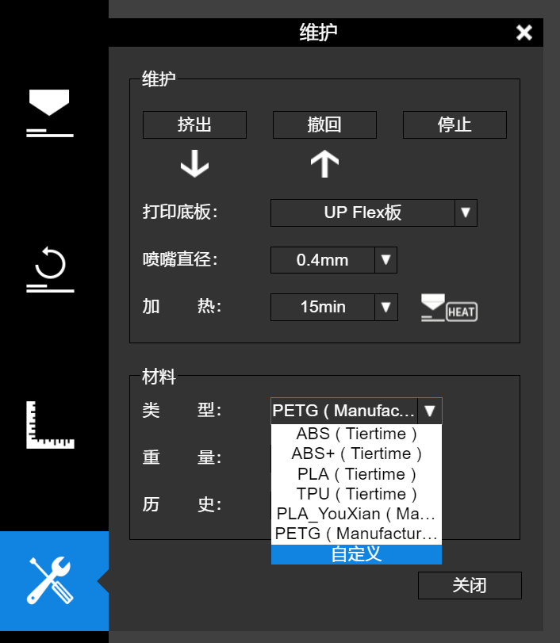
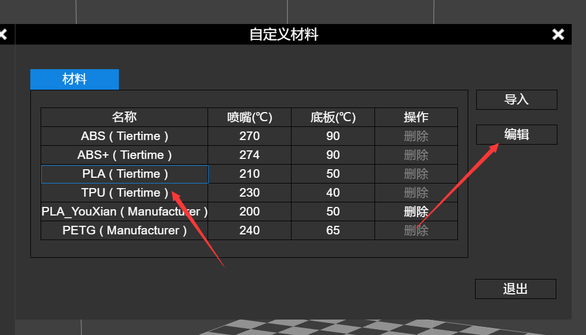
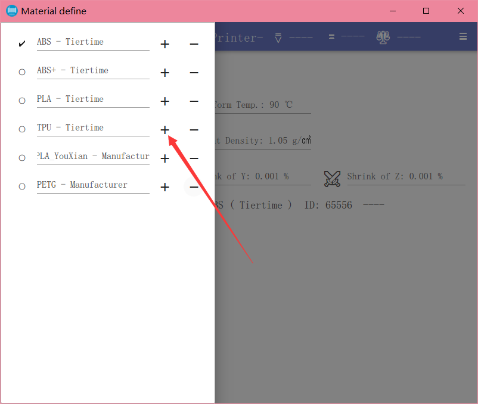
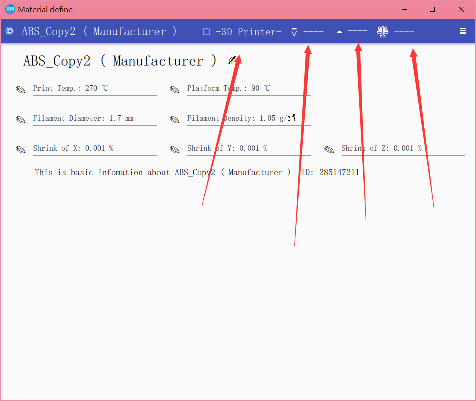
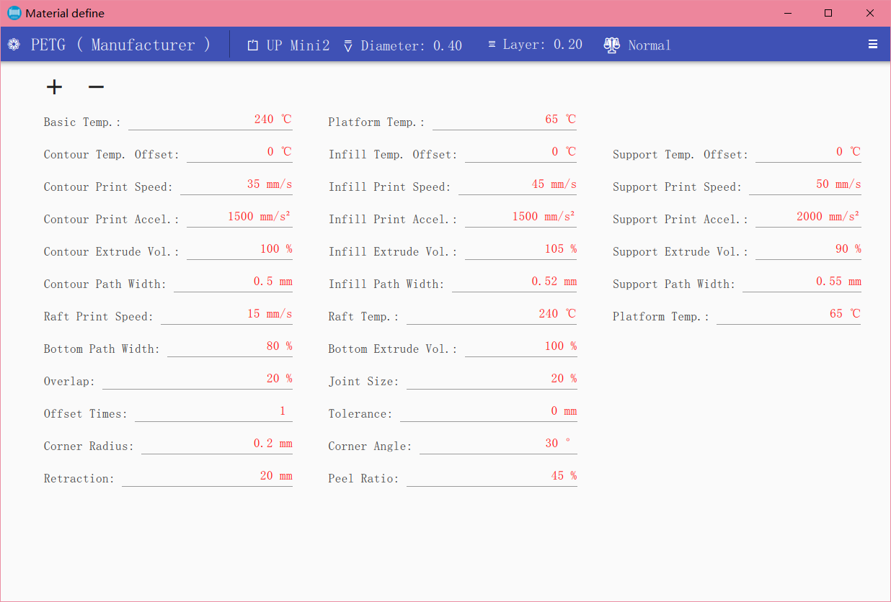
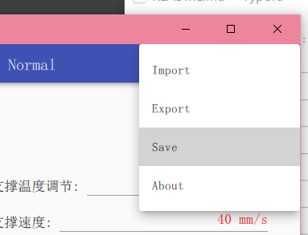

#  太尔时代 UP mini 2 使用第三方耗材的选购调参随笔
## 引言

~~由于一些奇怪的限制，太尔时代的打印机一般都不能使用市面上常见的第三方耗材，同时官方耗材的价格又奇高。本人尝试了两种常见的耗材，均会打印一段时间后堵头。我的学长尝试了三种，也是如此。在这里分享一下我在淘宝上找到测试过能打印的耗材，以及可能不是很完美但是能用的配置文件。当然，手头有其他三方耗材的也可一试，反正堵头其实应该不是真堵，而是料卡住了下不去，退出换料即可。~~

在散热器和喉管之间补上硅脂似乎就能正常打印三方pla了

## 一些用过的耗材及品牌

### 优线

价格：59/kg

~~这家店的宣传其实个人觉得很emmm，个人感觉，这种材料进口实属没必要，而且看这价格感觉也没有进口的睾贵气质。~~

至少这家店的耗材，能正常打。本人购入的为[PLA+](https://item.taobao.com/item.htm?spm=a1z09.2.0.0.421f2e8d8w64tr&id=535434345089&_u=72oc0e6u4027)，温度215有点拉丝，我调到200度用着还行。

强度有点弱，稍微用力一掰就可能断了。

### polymaker

价格：119/kg

~~这家店看着还挺高端~~

~~买了个小样，还没到货，~~看宣传说防堵头技术。试用感觉很不错，强度似乎比原装高点，但也带来了支撑难剥离的问题。

## 兰博

似乎兰博的PLA会遇到堵头的问题，我购入了兰博的PETG，240/65能正常打，似乎强度不是很高，甚至赶不上polymaker和原装的PLA(?)。

## 在UP Studio如何修改温度

emm这软件做的，反正个人不敢恭维，而我在使用的这台太尔没有sd卡槽，只能通过这个软件走usb或者WiFi连接到打印机进行打印。不过他家的切片做的似乎还行，也有打印开始前预挤出。

[官方资料]([太尔材料编辑器 – 3D打印机企业|北京太尔时代科技有限公司官网 (tiertime.cn)](https://www.tiertime.cn/太尔材料编辑器/))（明明是中国企业，中文文档一股浓浓的机翻味。。。。

首先选择维护-材料-类型，选择自定义

然后点击tiertime的预设材料后点击编辑

点击左上方的材料，再点击一种材料旁边的加号制作一个副本

然后修改名称，再点击上方的各种分类修改细分的配置

点击右上角save

附上翻译（右上角about-中文）

## 使用第三方软件切片

教程中有使用simplify3D切片打印的教程，试用了下照着就能打出来，但是似乎效果没有up studio的好？
